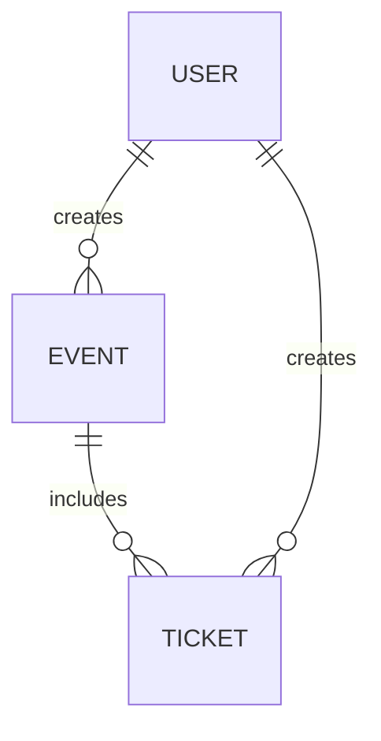
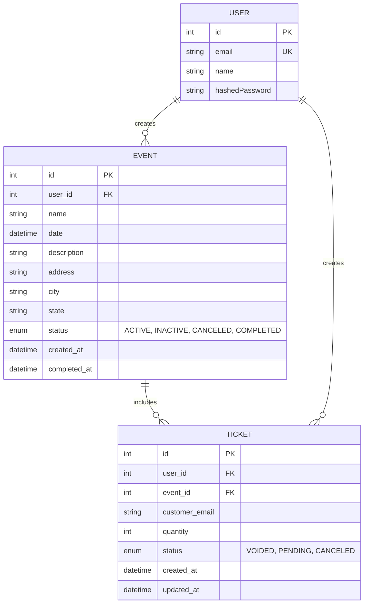

# Event Management App

## Introduction

This is a simple event management app, intended to provide a way for event planners to create events and tickets for their customers. Users also have the ability to set the status of tickets.

## Purpose

Give event planners a handy tool for organizing events and tracking tickets manually. Instead of using notepads, our app lets users easily handle events, manage tickets, and update their status effortlessly.

## Features

#### Must Have

- Ability to create a user
- Ability to create an event
- Ability to create a ticket for an event
- Ability to set the status of a ticket
- Ability to set the status of an event

####  Should Have

- Ability to update an event
- Ability to update a ticket
- Ability to login with email

#### Could Have

- Ability to update user info
- OAuth login
- Ability to delete a ticket
- Ability to delete an event
- Ability to delete a user and all of their events and tickets

#### Wish list

- Ability to log in user
- Ability to duplicate an event
- Teams/Organizations

## Domain Diagram

## ERD

